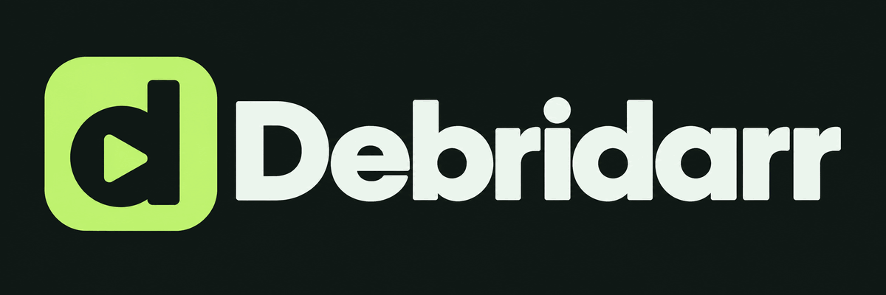
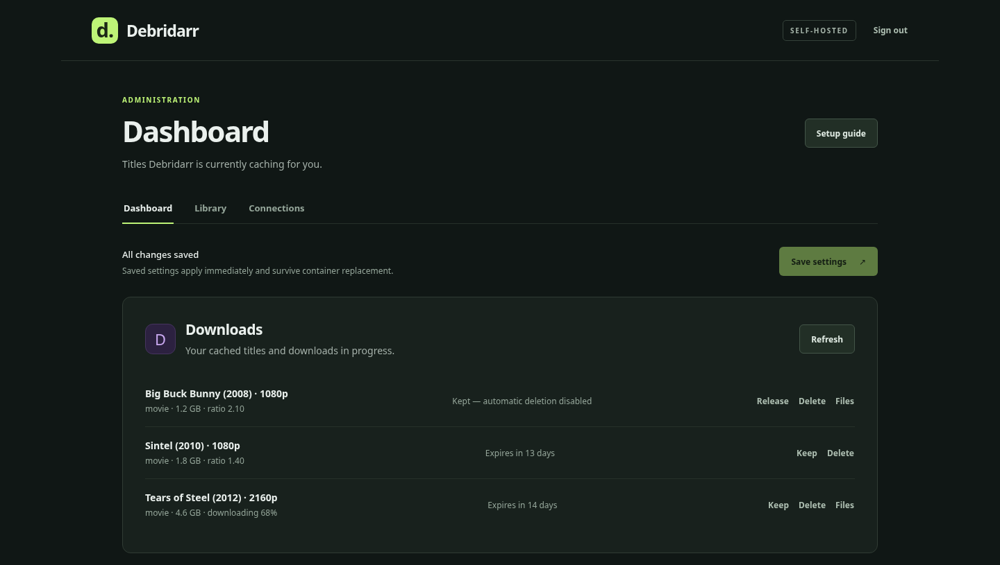
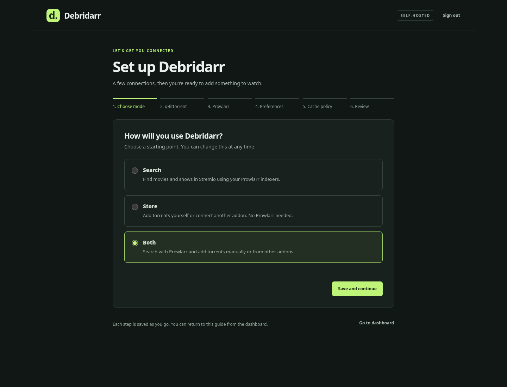
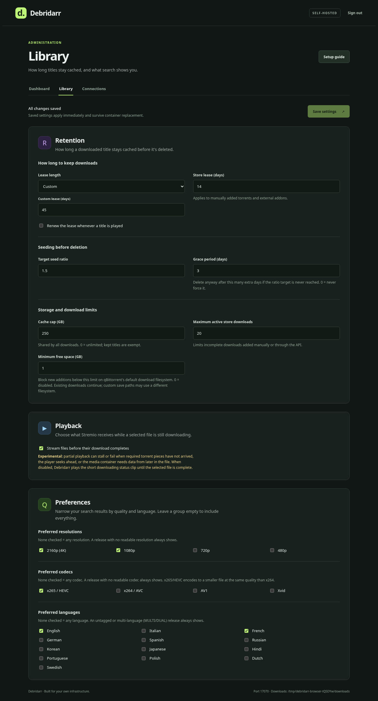
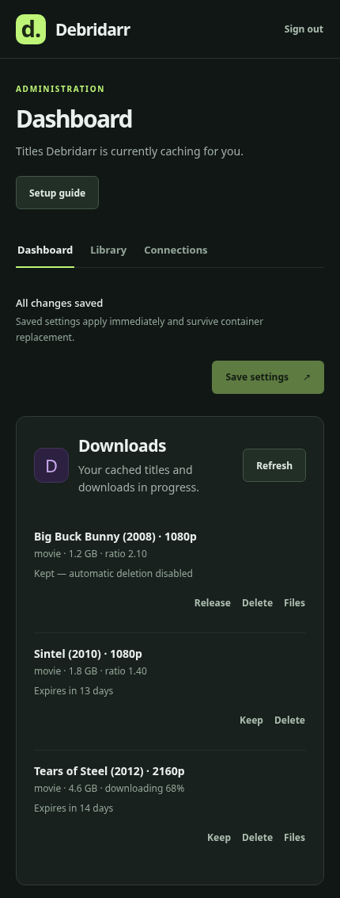

<p align="center">
  
</p>

A self-hosted debrid backend and Stremio addon. Debridarr sends torrents to
qBittorrent, Transmission, or Deluge (or NZBs to SABnzbd), streams the files to Stremio, and clears old downloads to free space.
Watching a title renews its cache timer; you can also keep favourites indefinitely.

Your cache lives on your server. While a selected file downloads, Stremio shows
a short status clip by default. Experimental partial playback can be enabled in
the administration site. Debridarr does not transcode video.



<details>
<summary>More screenshots</summary>

Screenshots show the actual interface with demo data.







</details>

## Choose how you use it

- **Search:** find content through Prowlarr or direct Torznab indexers and play it in Stremio.
- **Store:** add magnets, torrent files or infohashes manually or through the API.
- **Both:** combine search and store features in one library.

Self-hosted AIOStreams and Comet have configurable integration paths. See
[API setup](docs/store-api.md) and the [compatibility matrix](docs/compatibility.md)
for pinned versions, tested surfaces, and known gaps.

For direct clients, the canonical [native API](docs/api-v1.md) lives under
`/api/v1` with scoped bearer tokens, cursor pagination, idempotent creation, and
an OpenAPI document at `/api/v1/openapi.json`. A Real-Debrid REST 1.0
torrent-compatible adapter is documented in [docs/real-debrid.md](docs/real-debrid.md).

## Get started

You need **Docker Compose on Linux**, a download client (**qBittorrent,
Transmission, Deluge, or SABnzbd**), and access to its download folder. Search
also needs **Prowlarr or at least one Torznab-compatible indexer**.

1. Save [compose.yaml](compose.yaml) and [.env.example](.env.example) in the same
   folder. Rename `.env.example` to `.env`.
2. Edit these values in `.env`:

   ```dotenv
   APP_URL=http://your-server:7000
   ADMIN_PASSWORD=choose-a-strong-password
   QBITTORRENT_DOWNLOADS_DIR=/path/to/qbittorrent/downloads
   ```

   Use an address your browser and Stremio can reach. The download path must be an
   existing folder on the Docker host containing both complete and incomplete
   downloads. If qBittorrent uses a container path other than `/downloads`, set
   `DOWNLOAD_DIR` in `.env` to match it.
3. Start Debridarr:

   ```sh
   docker compose up -d
   ```

4. Open your `APP_URL`, sign in, and follow the setup guide to configure
   your download client, discovery providers and their per-provider search
   preferences, and cache settings. Install the Stremio addon
   using the link on the dashboard.

After your first download starts, run **Check playback readiness** on the dashboard
to verify file access. Debridarr's download mount is intentionally read-only;
qBittorrent handles writing and deleting files.

Debridarr stores all state (settings, downloads, tokens, scheduled jobs) in a
single SQLite database by default. If you have existing JSON state files from an
earlier version, they are imported automatically on first startup and backed up.
See [Configuration](docs/configuration.md) for details and the legacy JSON driver
option.

## Help and documentation

- [Configuration](docs/configuration.md) · [OMV setup](deploy/omv/README.md)
- [Native API](docs/api-v1.md) · [Store API](docs/store-api.md) · [Compatibility](docs/compatibility.md)
- [RSS saved searches](docs/rss.md) · [Completion webhook](docs/webhooks.md) · [WebDAV](docs/webdav.md)
- [Playback troubleshooting](docs/playback.md) · [Backups and upgrades](docs/operations.md)
- [Contributing](CONTRIBUTING.md) · [Release process](docs/releasing.md) · [Roadmap](ROADMAP.md) · [Report a security issue](SECURITY.md)
- [Changelog](CHANGELOG.md)

## License

Debridarr is free for personal, noncommercial use. Development forks are allowed
for contributing improvements upstream; independent or rebranded distributions
are not permitted. Commercial use requires a separate paid license from Brcly.
See [LICENSE.md](LICENSE.md), [commercial licensing](COMMERCIAL-LICENSE.md), and
the [name and logo policy](TRADEMARKS.md).

## AI Disclosure

AI was used in some areas of the project: debugging, tests, GitHub Actions
workflows, and limited work on the administration site.
